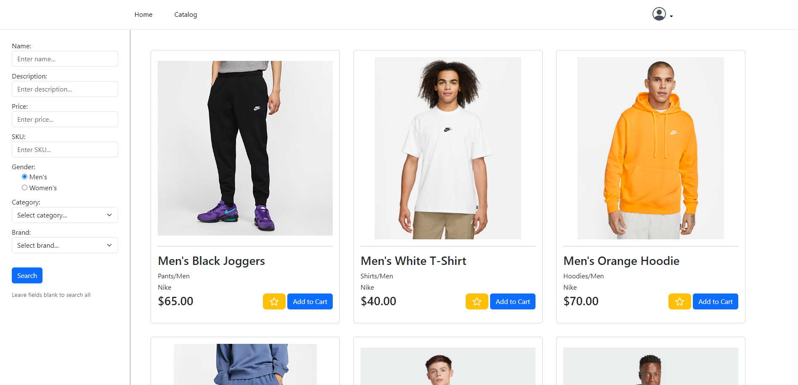
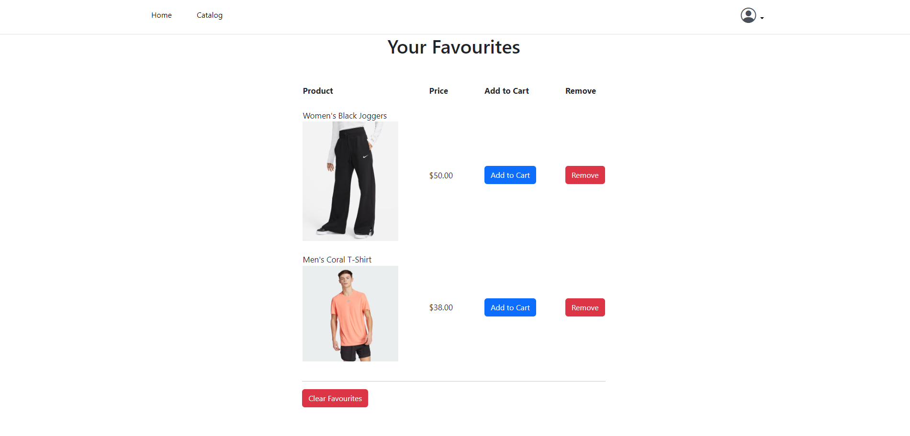

# Obsidian

Obsidian is a full-stack ecommerce web application. Create an account to browse the catalog, where you can filter your search based on several categories.\

Add items to your cart, and view your cart from the account dropdown menu in the nav. If you see an item you like but aren't ready to add it to your shopping cart just yet, add it to your favourites.\

Use the account dropdown to view your favourite items, where you can send them to your shopping cart, or remove them. Update your account information in 'View Profile', where any changes will be reflected immediately in the database.

# Setup

1. Install XAMPP in the root directory (C:\\)
2. Clone this repository in C:\xampp\htdocs\
3. Open XAMPP and start the Apache and MySQL servers
4. Open http://localhost/phpmyadmin
5. Go to the 'Import' tab, then in the first panel click 'Choose file' and open the database setup file (C:\xampp\htdocs\Obsidian-Ecomm\db\clothing_ecommerce.sql)
6. Scroll to the bottom and click import
7. Open http://localhost/Obsidian-Ecomm/ and enjoy!
